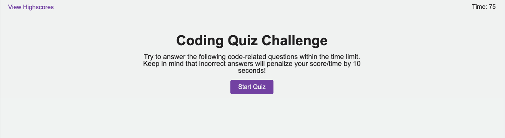
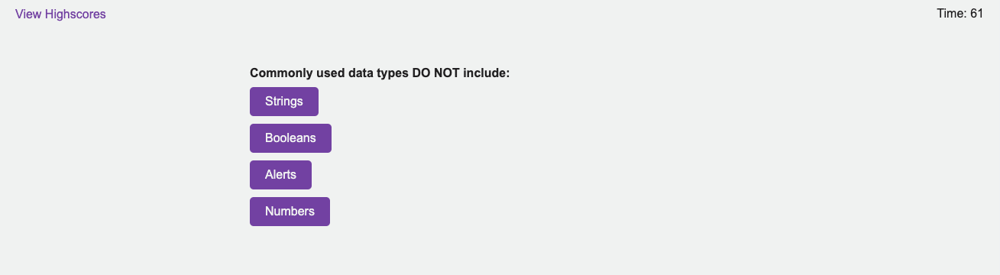
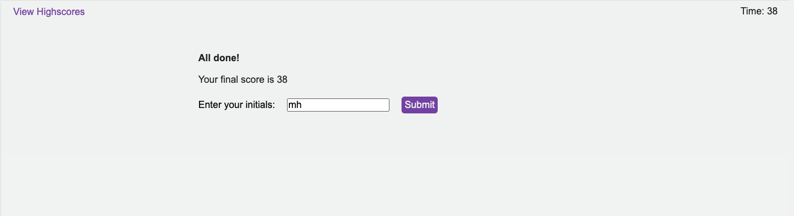
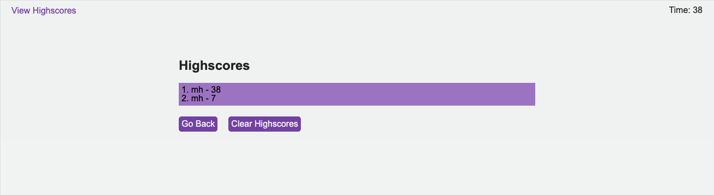

# Code Quiz

## Description

This is a dynamic web-based quiz application that tests users on their knowledge of JavaScript fundamentals. The quiz is timed, and users are penalized for incorrect answers by having time deducted from the timer. At the end of the quiz, users can save their scores and view high scores from previous sessions.

- **Motivation**: I wanted to create a fun and interactive way for individuals to test their knowledge on JavaScript fundamentals. This project also allowed me to demonstrate my skills in creating dynamic web applications.
- **Purpose**: This quiz serves as both an educational tool for those looking to test their knowledge and as a testament to my abilities in web development.
- **Problem it Solves**: It provides an engaging platform for users to challenge themselves on JavaScript concepts, while also offering a competitive aspect with the ability to save and compare scores.
- **What I Learned**: Through the development of this quiz, I deepened my understanding of JavaScript, especially in areas like event handling, timers, and local storage. I also refined my skills in creating responsive user interfaces.

## Installation

To experience the quiz, simply head over to the deployed website. If you'd like a local copy, you can clone the repository and launch the `index.html` file in your preferred web browser.

## Usage

Experience the quiz firsthand here: [Code Quiz](https://isaacmasterman.github.io/M04C-CodeQuiz/)

Below are some snapshots of the quiz in action:

## Credits

- The `reset.css` was sourced from the Week 2 Day 3 materials of the EdX Coding Bootcamp Course.

## License

This project is protected under the MIT License.
